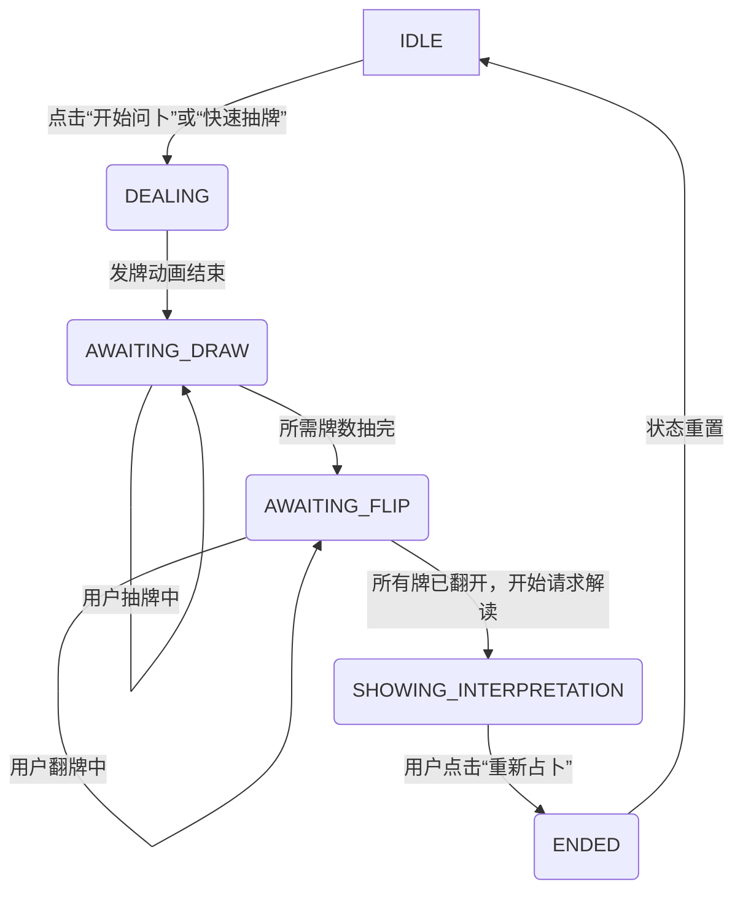

# 命运星盘：架构分析与重构计划

## 1. 现状与核心问题

当前应用虽功能完整，但架构上存在紧急问题，导致核心UI（如“重新占卜”按钮）无响应。问题根源在于：

- **脆弱的状态管理**: 应用流程严重依赖 `setTimeout` 和散乱的布尔标志（boolean flags）来控制异步流程，缺乏明确、统一的状态管理，导致竞态条件和不可预测的UI行为。
- **复杂的DOM结构与事件处理**: `index.html` 中存在过多的覆盖层（如 `immersive-container`），引发了 `z-index` 堆叠上下文问题。事件监听器在代码各处被动态添加和移除，逻辑分散，难以追踪，是导致按钮失灵和事件冲突的直接原因。

## 2. 重构目标：引入状态机与简化DOM

本次重构的核心目标是建立一个健壮、可预测、易于维护的前端交互模型。

- **引入状态机 (State Machine)**: 实现一个中央状态机来精确管理整个占卜流程，使状态转换清晰、原子化且可预测。
- **简化DOM结构**: 重构 `index.html`，采用更扁平、由状态驱动的视图渲染模式，从根本上消除 `z-index` 和布局冲突。
- **统一事件管理**: 所有用户交互事件都由状态机根据当前状态统一分发和管理，确保在正确的时机激活或禁用相应的监听器。

---

## 3. 详细重构计划

### 第一阶段：实现中央状态机

我们将创建一个中央状态管理器，并定义严格的应用状态，这将是本次重构的核心。

#### 3.1 状态定义 (State Definition)

应用将围绕以下几个核心状态进行构建：

- `IDLE`: **初始状态**。显示主界面，用户可以选择占卜模式或与导航交互。所有交互入口点都处于激活状态。
- `DEALING`: **发牌动画状态**。显示洗牌、发牌等动画效果。此状态下，所有用户交互（点击等）应被**完全阻止**，以防止在动画期间触发意外操作。
- `AWAITING_DRAW`: **等待抽牌状态**。牌堆（Fan Deck）已展示。只有牌堆中的牌可以被点击，用于抽牌。其他所有交互均被禁用。
- `AWAITING_FLIP`: **等待翻牌状态**。牌阵已布局完成。只有面朝下的牌可以被点击，用于翻牌。其他所有交互均被禁用。
- `SHOWING_INTERPRETATION`: **显示解读状态**。AI生成的解读文本正在显示或已显示完毕。用户可以滚动阅读、复制文本、保存截图。 “重新占卜”按钮在此状态下出现。
- `ENDED`: **占卜结束状态**。在用户完成阅读或分享后进入此状态。主要交互是“重新占卜”按钮，点击后将状态重置为 `IDLE`。

#### 3.2 状态转换逻辑 (State Transition Logic)

状态之间的转换必须是严格且单向的，以保证流程的确定性。



#### 3.3 实现步骤

1.  **更新 `src/js/state.js`**:
    -   移除所有分散的布尔标志（如 `isAnimating`, `cardsDrawn` 等）。
    -   创建一个核心的 `appState` 对象，至少包含 `currentState` 属性。
    -   实现一个 `setState(newState, payload)` 函数。这个函数将是**唯一**可以改变应用状态的地方。它会更新 `currentState`，并调用一个 `render()` 函数来更新UI。

2.  **创建 `render()` 引擎**:
    -   在 `ui.js` 中创建一个核心的 `render(state)` 函数。
    -   此函数接收最新的状态对象作为参数。
    -   它内部使用一个 `switch (state.currentState)` 语句，根据当前状态，精确地控制哪些DOM元素应该显示、隐藏或更新。
    -   **关键**：`render()` 函数还需要负责事件监听器的绑定与解绑。例如，当进入 `AWAITING_FLIP` 状态时，它会为所有未翻开的牌添加 `click` 监听器；而当离开此状态时，它必须移除这些监听器。

3.  **重构事件处理**:
    -   移除所有在 `setTimeout` 回调中或在其他函数（如 `initFanDeck`）内部动态绑定的 `onclick` 事件。
    -   `main.js` 中的 `initApp` 只绑定**永久性**的事件监听器（如顶部导航、主题切换等）。
    -   所有与流程相关的按钮（`startBtn`, `quickDrawBtn`, `restartBtn`）的点击处理器将被极度简化：它们**只**调用 `setState()` 来请求状态变更，而不执行任何业务逻辑。例如，`startBtn.onclick = () => setState('DEALING');`。

### 第二阶段：简化 DOM 结构

我们将重构 `index.html`，用一个更扁平、更易于管理的结构来取代当前复杂的覆盖层。

#### 4.1 核心思想：视图容器化

- **单一视图容器**: 废弃 `immersive-container` 和其他复杂的覆盖层。引入一个单一的主视图容器，例如 `<main id="app-view"></main>`。
- **模板化视图**: 为每个核心应用状态（`IDLE`, `AWAITING_DRAW`, `AWAITING_FLIP`, `SHOWING_INTERPRETATION`）创建对应的HTML结构“模板”。
- **动态渲染**: 当状态改变时，`render()` 函数负责清空主容器，并将对应状态的模板渲染进去。这从根本上消除了 `z-index` 冲突，因为在任何给定时间，只有一个“视图”是活动的。

#### 4.2 拟定新 `index.html` 结构

```html
<!DOCTYPE html>
<html lang="zh-CN">
<head>
  <!-- Meta, Title, Links -->
</head>
<body>
  <!-- 永久性背景元素 -->
  <div id="nightOverlay"></div>
  <canvas id="starfield"></canvas>

  <!-- 永久性UI元素 -->
  <audio id="bgMusic"></audio>
  <div class="top-nav">
    <button id="musicToggle">🎵 灵性环境音</button>
    <button id="historyBtn">📜 占卜记录</button>
  </div>

  <!-- 主视图容器：所有动态内容将在此渲染 -->
  <main id="app-view"></main>

  <!-- 侧边栏/模态框 (可独立于主视图管理) -->
  <div id="historyPanel" class="aside-panel" style="display: none;"></div>
  <div id="vipModal" class="modal-overlay" style="display: none;"></div>

  <script type="module" src="src/js/main.js"></script>
</body>
</html>
```

#### 4.3 实现步骤

1.  **创建视图模板**: 在 `ui.js` 中，为每个状态创建生成HTML字符串的函数。例如：
    -   `createIdleView()`: 返回主选择界面的HTML。
    -   `createDrawView()`: 返回抽牌界面的HTML（包含扇形牌堆）。
    -   `createFlipView(cards)`: 返回牌阵界面的HTML。
    -   `createInterpretationView(reading)`: 返回解读界面的HTML。

2.  **增强 `render()` 函数**: `render()` 函数现在将执行以下操作：
    -   获取 `app-view` 容器。
    -   根据 `state.currentState` 调用对应的 `create...View()` 函数获取HTML字符串。
    -   将 `app-view.innerHTML` 设置为新的HTML。
    -   **在渲染后**，立即查询新生成的DOM元素并绑定必要的、仅在此状态下有效的事件监听器（例如，为新渲染的卡牌绑定点击事件）。

### 5. “重新占卜”按钮的整合

“重新占卜”按钮 (`restartBtn`) 的逻辑将变得极其简单和健壮：

-   它只在 `SHOWING_INTERPRETATION` 或 `ENDED` 状态的视图模板中被渲染出来。
-   它的 `onclick` 事件处理器只有一个职责：`() => setState('IDLE')`。
-   状态机接收到 `IDLE` 状态后，`render()` 函数会自动清空 `app-view` 并重新渲染初始的主选择界面，从而以一种可预测的方式完成整个应用的重置。

这个计划通过强制性的状态管理和视图分离，将彻底根除当前架构的混乱，为未来的功能扩展和维护打下坚实、可靠的基础。
