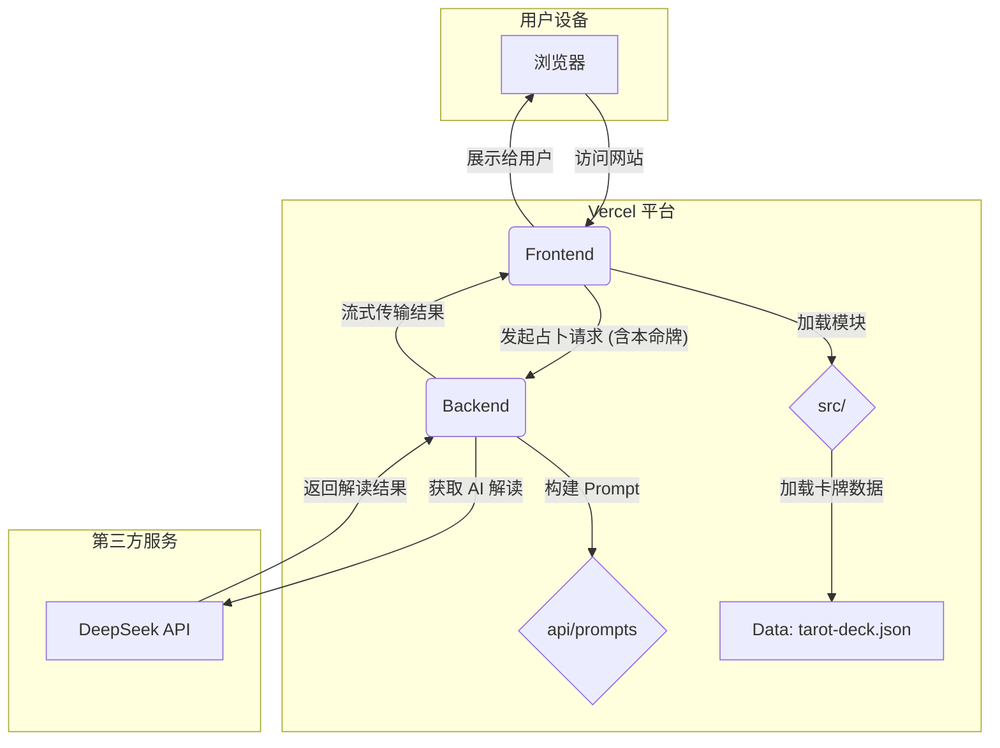

# 命运星盘：架构分析与改进计划

## 1. 现状分析 (As-Is)

在深入探讨改进方案之前，我们首先对当前“命运星盘”应用的架构和代码进行全面分析。

### 1.1. 整体架构

应用采用了经典的前后端分离架构，这为未来的扩展和维护奠定了良好的基础。

-   **前端 (Frontend)**: 一个单页应用（SPA），由 `index.html`, `style.css`, 和 `script.js` 构成。它负责用户界面、交互逻辑和与后端的通信。
-   **后端 (Backend)**: 一个部署在 Vercel 上的 Serverless Function (`api/tarot.js`)。它作为前端和大型语言模型（DeepSeek API）之间的网关，处理核心的占卜逻辑。
-   **数据 (Data)**: 静态的 `tarot-deck.json` 文件，包含了所有塔罗牌的基础信息。

**架构图 (当前):**

```mermaid
graph TD
    subgraph "用户设备"
        A[浏览器]
    end

    subgraph "Vercel 平台"
        B[Frontend: index.html, style.css, script.js]
        C[Backend: /api/tarot (Serverless Function)]
        D[Data: tarot-deck.json]
    end

    subgraph "第三方服务"
        E[DeepSeek API]
    end

    A -- "访问网站" --> B
    B -- "加载卡牌数据" --> D
    B -- "发起占卜请求" --> C
    C -- "获取 AI 解读" --> E
    E -- "返回解读结果" --> C
    C -- "流式传输结果" --> B
    B -- "展示给用户" --> A
```

### 1.2. 代码分析

-   **`script.js`**: 这是应用的核心。目前，它是一个巨大的单体脚本，包含了几乎所有的前端逻辑：
    -   **状态管理**: 全局变量（`deck`, `drawnCardsData`, `paymentConfirmed` 等）散落在各处。
    -   **UI 操作**: DOM 元素的获取、显示/隐藏、内容更新等函数。
    -   **业务逻辑**: 洗牌、抽牌、翻牌、调用 API、处理历史记录等核心流程。
    -   **特效与动画**: 开场打字机、星空背景等。
-   **`style.css`**: 视觉效果非常出色，但同样是一个庞大的单体文件。虽然使用了 CSS 变量，但随着功能增加，文件会越来越难以维护。
-   **`api/tarot.js`**: 功能集中，职责明确。主要负责构建 Prompt 并与 LLM API 通信。代码质量较高，但 Prompt 的构造逻辑可以进一步优化和模块化。

### 1.3. 总结

**优点:**

-   **功能完整**: 核心占卜流程已闭环。
-   **体验优秀**: 动画和视觉效果增强了沉浸感。
-   **架构清晰**: 前后端分离的模式是正确的。

**待改进点:**

-   **前端代码耦合度高**: `script.js` 和 `style.css` 的单体结构使其难以维护和扩展。
-   **状态管理混乱**: 全局变量满天飞，容易导致不可预见的 bug。
-   **可复用性差**: 很多 UI 组件和逻辑（如弹窗、卡片）被硬编码在主流程中，无法方便地复用。
-   **功能扩展性受限**: 当前的结构下，要增加新的牌阵、新的占卜模式或新的交互会非常困难。

接下来，我们将基于以上分析，提出具体的优化和增强计划。

## 2. 优化建议 (To-Be)

### 2.1. 代码结构优化：走向模块化

当前的单体文件结构是技术债务的主要来源。我们建议进行模块化重构，将代码按功能拆分到不同的文件中。

**目标：**

-   **高内聚，低耦合**: 每个模块只做一件事，模块间的依赖关系清晰。
-   **可维护性**: 修改一个功能时，只需要关心对应的模块，而不是整个 `script.js`。
-   **可复用性**: UI 组件（如弹窗、卡片）和工具函数（如洗牌算法）可以被轻松复用。

**建议的目录结构:**

```
/ (根目录)
|-- index.html
|-- tarot-deck.json
|-- api/
|   |-- tarot.js
|-- src/
|   |-- js/
|   |   |-- main.js         # 应用主入口，负责初始化和协调
|   |   |-- state.js        # 集中管理应用的状态
|   |   |-- ui.js           # 负责所有 DOM 操作和 UI 更新
|   |   |-- tarot.js        # 负责塔罗牌相关逻辑（洗牌、抽牌、牌阵定义）
|   |   |-- api.js          # 封装所有与后端 API 的通信
|   |   |-- animations.js   # 管理所有的动画效果（星空、洗牌等）
|   |   |-- components/     # 可复用的 UI 组件
|   |   |   |-- modal.js
|   |   |   |-- card.js
|   |-- css/
|   |   |-- main.css        # 全局基础样式
|   |   |-- components/     # 各组件的独立样式
|   |   |   |-- _buttons.css
|   |   |   |-- _cards.css
|   |   |   |-- _modal.css
|   |   |-- layout/         # 布局相关样式
|   |   |   |-- _header.css
|   |   |   |-- _grid.css
```

**实施步骤:**

1.  **引入模块系统**: 在 `index.html` 中，将 `<script src="script.js">` 修改为 `<script type="module" src="src/js/main.js">`。这将允许我们使用 ES6 的 `import` 和 `export` 语法。
2.  **创建 `state.js`**: 将所有全局变量（`deck`, `drawnCardsData`, `isMusicPlaying` 等）移入此文件，并以 `export` 的形式暴露出去。其他模块通过 `import` 来获取和修改状态。
3.  **创建 `ui.js`**: 将所有直接操作 DOM 的函数（如 `updateStatus`, `showEnergyEffect`）移入此文件。
4.  **创建 `tarot.js`**: 将 `spreadsOptions`, `shuffle`, `renderSpread` 等与塔罗牌本身相关的逻辑移入此文件。
5.  **创建 `api.js`**: 封装 `fetchStream` 函数，使其成为一个独立的 API 调用模块。
6.  **重构 `main.js`**: `main.js` 将作为应用的“指挥中心”。它会 `import` 其他模块，并在 `window.onload` 中执行初始化逻辑，绑定事件监听器。
7.  **拆分 CSS**: 将 `style.css` 按照组件和布局拆分成多个小文件，然后在 `main.css` 中使用 `@import` 将它们组合起来。这使得样式的管理更加清晰。

### 2.2. 功能增强：提升占卜体验的深度与广度

在优化代码结构的基础上，我们可以引入更多有趣和实用的功能，让“命运星盘”不仅仅是一个简单的占卜工具，更是一个充满探索乐趣的神秘世界。

**建议的新功能:**

1.  **“本命牌”计算与展示**
    -   **功能描述**: 在主界面增加一个输入框，让用户输入自己的出生年月日。通过简单的生命数字算法（例如，将年月日所有数字相加，直至得到一个 1-22 之间的数字），计算出用户的“本命牌”（对应一张大阿尔卡那牌）。
    -   **实现思路**:
        -   **前端**: 在 `index.html` 中增加日期输入框和“计算本命牌”按钮。在 `tarot.js` 中增加一个计算函数。计算出的本命牌信息（牌名、图片、关键词）可以优雅地展示在用户界面上。
        -   **后端**: 在调用 `api/tarot.js` 进行深度解读时，可以将“本命牌”信息一并传入。后端 Prompt 可以加入“请结合用户的本命牌【XX】进行分析”的指令，使解读更加个性化。

2.  **牌阵选择界面优化**
    -   **功能描述**: 目前的牌阵选择是一个简单的下拉菜单，不够直观。可以设计一个更具交互性的牌阵选择界面，例如使用卡片式布局，每个卡片展示一个牌阵的名称、形状示意图和简短说明。
    -   **实现思路**:
        -   **前端**: 可以创建一个模态框（Modal）或者一个新的页面区域来展示所有牌阵。当用户点击“选择牌阵”时，弹出这个界面。`spreadsOptions` 对象可以扩展，增加 `description` 和 `shape` (一个简单的SVG或图像路径) 字段。

3.  **牌义查询手册 (Grimoire)**
    -   **功能描述**: 增加一个“塔罗手册”或“卡牌百科”功能。用户可以随时查看所有78张塔罗牌的详细信息，包括正逆位牌义、元素、象征等。
    -   **实现思路**:
        -   **前端**: 创建一个新的页面或大型模态框。从 `tarot-deck.json` 加载数据，并以网格或列表的形式展示所有卡牌。增加搜索和筛选功能（例如按大/小阿尔卡那、元素进行筛选）。点击单张卡牌后，展示其详细信息。

4.  **后端 Prompt 动态构建与管理**
    -   **功能描述**: `api/tarot.js` 中的 Prompt 是硬编码的。为了方便未来迭代和优化，可以将其模块化。
    -   **实现思路**:
        -   **后端**: 在 `api` 目录下创建一个 `prompts` 文件夹。将不同的 prompt 逻辑（如日签、不同风格的长文解读）拆分成不同的文件或函数。例如，`prompts/daily.js` 导出一个生成日签 prompt 的函数，`prompts/reading.js` 导出一个根据风格、问题、牌阵生成长文解读 prompt 的函数。`api/tarot.js` 则根据请求参数，动态地调用这些函数来构建最终的 Prompt。

**架构图 (增强后):**



### 2.3. 视觉与体验提升：增强神秘感与仪式感

“神秘感”是塔罗占卜的核心魅力之一。我们可以通过一些细节设计，进一步强化这种感觉。

**建议的改进点:**

1.  **更丰富的卡牌视觉**
    -   **问题**: 目前卡牌只显示了 Emoji 和名称，比较单薄。
    -   **建议**: 为每张塔罗牌设计或寻找一套风格统一的卡牌图片（例如，经典的韦特塔罗牌图）。在 `tarot-deck.json` 中为每张牌增加一个 `image_url` 字段。在翻牌和“塔罗手册”中，展示这些精美的牌图，这将极大地提升视觉吸引力和专业感。

2.  **增强“洗牌”的仪式感**
    -   **问题**: 当前的洗牌动画只是一个简单的过场。
    -   **建议**: 让用户“参与”到洗牌过程中。例如，在洗牌动画期间，提示用户“点击屏幕任意位置切牌”或“滑动来洗牌”。虽然这只是一个象征性的交互，但它能极大地增强用户正在“亲手”操作的仪式感。

3.  **“冥想”环节的交互升级**
    -   **问题**: “深呼吸，专注你的问题”的提示是静态的。
    -   **建议**: 可以将这个环节做得更具引导性。例如，背景变为更深邃的星空，呼吸光圈的动画与提示文字（“吸气...”、“呼气...”）同步。甚至可以加入引导性的音效（如钟声、风声），帮助用户真正静下心来。

4.  **解读报告的精致化**
    -   **问题**: 羊皮纸风格的解读报告已经很棒了，但可以更进一步。
    -   **建议**: 在报告的顶部，除了文字，还可以将用户抽到的几张牌的牌图（正/逆位）展示出来，形成一个完整的“牌阵回顾”。在“保存为图片”时，将这个包含牌图的完整报告一并生成，使其更具分享价值。

## 3. 总结与后续步骤

这份计划旨在将“命运星盘”从一个优秀的应用提升为一个卓越的、可持续发展的项目。通过代码的模块化重构、功能的深度增强和体验的精心打磨，我们能够构建一个更健壮、更迷人、更具生命力的在线塔罗体验。

**下一步行动:**

我们建议将这个计划分为几个阶段实施，首先从**代码结构优化**开始，因为它是一切后续开发的基础。在代码结构变得清晰之后，再逐步实现各项功能增强和体验提升。
